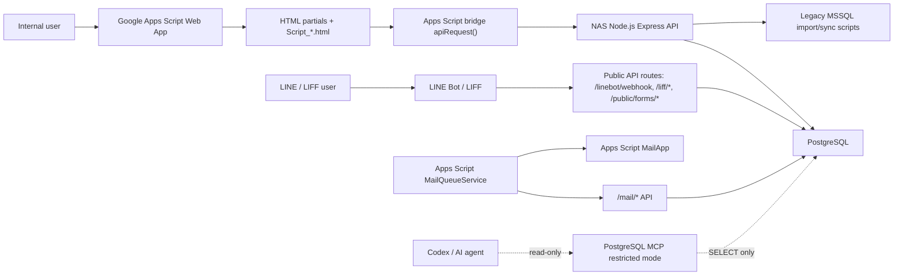

# TopChurchPlus Project Context Snapshot

Status: AI / Developer Context Snapshot
Last updated: 2026-06-14
Source basis: current repository files, `AGENTS.md`, `docs/*`, `plan/*`, `Script_FeatureConfig.html`, `api/src/modules/*/routes.js`, and database migration/docs files.

Important: This snapshot is a fast context artifact, not a schema authority. For database-impacting work, use PostgreSQL MCP with `topchurchplus_ai_reader` in restricted mode before implementation.

## 1. Executive Summary

TopChurchPlus is a church administration and pastoral operations system. It combines an internal Google Apps Script admin UI, a NAS-hosted Node.js API, PostgreSQL persistence, LINE Bot / LIFF member entry, Email Queue management, and legacy MSSQL import/sync paths.

Main users:

- System administrators: users, roles, feature permissions, config keys, integrations, mail queue, dev handoff.
- Administrative staff: projects, meetings, forms, finance, counter, QRCode, venue, Zoom, resources.
- Pastoral staff: members, pastoral groups, attendance, education, care-related workflows.
- Finance staff: purchases, payment requests, expense proofs, QT payment and reporting.
- Volunteers: counter workflows, QT pickup, serving-related future entry points.
- Members: LINE / LIFF entry, binding, forms, and future member-facing services.

Current phase:

- Phase 2 style core-system buildout and incremental refactor.
- Product Design Review, Navigation Architecture V2, Design System V2, Classified Navigation POC, and UI Foundation Layer work are present in the repo.
- QT has active staged refactor work through inventory/reservation/payment/fulfillment foundations.
- Mail Queue / Email Service MVP is present.

Core goals:

- Preserve Identity Boundary v2.
- Keep Apps Script as the current admin frontend.
- Use PostgreSQL as the primary future data store.
- Incrementally migrate and refactor rather than rewriting the whole system.
- Keep AI/developer handoff cost low through docs, registries, and snapshots.

## 2. Architecture Summary

Actual stack in repo:

- Frontend/admin UI: Google Apps Script Web App with HTML partials and `Script_*.html`.
- Styling: `Style.html`, `css/design-system.css`, `css/topchurchplus-theme.css`, Bootstrap 5, Tabler Icons.
- API: Node.js Express under `api/src`.
- Database: PostgreSQL migrations under `database/`; legacy MSSQL import/sync scripts remain.
- LINE: `api/src/modules/linebot`, `api/src/modules/liff`, webhook route `/linebot/webhook`.
- LIFF: `/liff`, `/liff/config`, `/liff/session`, `/liff/me`, member/leader center routes.
- Email Service: Mail Queue API, Apps Script `MailQueueService`, MailApp quota snapshots, trigger management.
- MCP: PostgreSQL MCP docs exist under `docs/ai`; MCP is a read-only database verification tool layer, not an app runtime dependency.
- Deployment: NAS Docker / Container Manager for API; Apps Script deployment through project scripts.

## 3. Domain Model

Core domains currently visible in code/docs:

| Domain | Purpose | Main tables / modules | Relationship notes |
| --- | --- | --- | --- |
| Account Domain | Internal users, roles, feature permissions, system administration. | `accounts`, `account_roles`, `role_feature_permissions`, `system_usage_logs`, `audit_logs`, System module. | Controls admin feature access. Must not become pastoral scope authority by itself. |
| Pastoral Domain | Formal church member identity, pastoral groups, care context. | `pastoral_members`, `pastoral_groups`, `pastoral_group_closure`, `pastoral_care_records`, `member_accounts`, Pastoral module. | Pastoral Member is the formal member entity. |
| Line User Domain | LINE identity, LIFF sessions, binding, rich menu, webhook interactions. | `line_users`, `line_liff_sessions`, `line_bot_*`, `line_binding_requests`, Line Bot / LIFF modules. | LINE User is an entry identity, not the formal member. |
| Project Domain | Projects, meetings, permissions, budgets, documents. | `projects`, `project_people`, `project_permissions`, `meetings`, Project module. | Meeting can be project-linked or independent. |
| Finance Domain | Purchases, advances, payment requests, expense proofs. | `purchases`, `purchase_items`, `purchase_advances`, `purchase_expense_proofs`, `purchase_payment_requests`, `purchase_payment_items`. | Uses document generation and may link to projects/assets through `entity_links`. |
| Asset Domain | Fixed assets, locations, movements, asset records. | Asset module, `assets`, `locations` and related migration tables. | General affairs resource domain. |
| Reservation Domain | Venue and Zoom reservations; future generalized reservation model. | Venue routes, Zoom routes, `venue_*`, `zoom_*` migrations. | Physical/digital shared resource reservation. |
| QT Domain | QT ordering, inventory, reservations, payment, pickup, reports. | `qt_inventory_monthly`, `qt_inventory_reservations`, `qt_inventory_movements`, QT routes. | Uses 2026-09 cutover boundary; legacy data must not pollute new inventory model. |
| Mail / Notification Domain | Queue-based Email via Apps Script MailApp. | `mail_queue`, `mail_quota_snapshots`, Email Service module. | Normal modules enqueue mail; login verification email is the allowed immediate-send exception. |
| Workflow / BPM Domain | Workflow definitions, instances, history. | `bpm_definitions`, `bpm_instances`, `bpm_history`, Workflow routes. | v1 engine present; UI rollout still limited. |

## 4. Identity Boundary

Identity Boundary v2 is a hard rule:

- Account: internal/admin user identity used for login, role-feature access, admin usage logs, and system actions.
- Pastoral Member: formal church member identity and pastoral data source of truth.
- Line User: LINE identity and LIFF entry identity.

Rules:

- Pastoral Domain permission must not depend only on backend Account Role.
- LINE User must not be treated as the formal member.
- LIFF/member-facing flows must explicitly map or bind to Pastoral Member when member data is needed.
- Account role controls admin feature access; pastoral scope should be handled through pastoral-specific mappings/scope.
- Future providers such as Google Login, Apple Login, mobile app, or OAuth must map explicitly to Account or Pastoral Member.

## 5. Module Inventory

Source: `Script_FeatureConfig.html`; navigation classification from current feature category map.

| Name | Feature Key | Status | Domain | Navigation category |
| --- | --- | --- | --- | --- |
| 專案管理系統 | `project` | Active | Project | 行政類 |
| 會議管理 | `meeting` | Active | Project / Meeting | 行政類 |
| 表單系統 | `forms` | Active; extension design exists | Forms / Line/Pastoral boundary risk | 行政類 |
| 財務管理系統 | `finance` | Active / Beta | Finance | 行政類 |
| 櫃台工作台 | `counter` | Active | Counter / QT / Finance edge | 行政類 |
| QRCode 活動管理 | `qrcode` | Active | QRCode / attendance-adjacent | 行政類 |
| QT 管理系統 | `qt` | Active staged refactor | QT / Finance / Inventory | 行政類 |
| 牧養管理系統 | `pastoral` | Beta / active | Pastoral | 牧養類 |
| 聚會統計系統 | `attendance` | In progress / active routes | Attendance / Pastoral | 牧養類 |
| 教育管理系統 | `education` | Beta / active routes | Education / Pastoral | 牧養類 |
| Line App會友管理系統 | `linebot` | Active Phase 2-5 features | Line User / LIFF / Pastoral mapping | 資訊類 |
| Email 服務管理系統 | `email_service` | Active MVP | Mail / Notification | 資訊類 |
| 系統開發管理 | `dev_management` | Active | AI/dev operations | 資訊類 |
| 行政物資管理系統 | `admin_supply` | Active | General affairs / inventory | 總務類 |
| 資產管理系統 | `asset` | Active | Asset | 總務類 |
| 場地預約系統 | `venue` | Active / evolving | Reservation | 總務類 |
| Zoom帳號管理系統 | `zoom` | Active | Reservation | 總務類 |
| 主日信息管理系統 | `sunday_message` | Active | Media/content | 媒體類 |
| 媒體管理系統 | `media` | Coming soon | Media | 建置中 |
| 敬拜管理系統 | `worship` | Coming soon | Media / Worship | 建置中 |
| 系統管理 | `system` | Active | Account / System | 系統管理類 |
| 服事管理系統 | `serving` | Coming soon | Serving | 建置中 |

Additional API route modules not directly represented as feature cards:

- `auth`
- `core`
- `documents`
- `liff`
- `mail`
- `shortlinks`
- `workflow`
- `worklog`

## 6. Database Summary

Database source: repository migrations and `docs/DATABASE_SCHEMA.md`. Actual live schema must be verified with PostgreSQL MCP before DB work.

Core tables and keys:

| Area | Main tables | Core primary key / identifier | Relationship summary |
| --- | --- | --- | --- |
| Account | `accounts`, `account_roles`, `role_feature_permissions` | `accounts.staff_id`; role + feature key mappings | Controls admin feature access. |
| Audit / usage | `audit_logs`, `system_usage_logs` | audit/log IDs; staff/user refs | Records actions, usage, operator context. |
| Config | `system_config_keys`, legacy `system_config` | `(namespace, config_key)` for new table | Central key management; secrets masked in UI/API. |
| Mail | `mail_queue`, `mail_quota_snapshots` | `mail_queue.id`; snapshot ID | Queue item lifecycle and quota monitoring. |
| Files / links | `files`, `file_links`, `entity_links`, `domain_events` | file/link/event IDs | Shared attachments and cross-domain links. |
| Pastoral | `pastoral_members`, `pastoral_groups`, `pastoral_group_closure`, `pastoral_care_records`, `member_accounts` | member UUID / `member_code` | Formal member, group tree, care records, account/member mapping. |
| Line / LIFF | `line_users`, `line_liff_sessions`, `line_bot_channels`, `line_bot_rich_menus`, `line_bot_links`, `line_bot_module_settings` | LINE user ID / session token / UUIDs | LINE identity, sessions, rich menu and binding data. |
| Project / Meeting | `projects`, `project_people`, `project_permissions`, `project_income`, `project_budget`, `meetings` | `projects.project_id`; meeting ID | Project plans, permissions, budget, meetings. |
| Finance | `purchases`, `purchase_items`, `purchase_advances`, `purchase_expense_proofs`, `purchase_payment_requests`, `purchase_payment_items` | purchase/payment IDs | Purchase/payment workflows and finance docs. |
| Forms | `forms`, `form_questions`, `form_responses`, `form_response_answers` | form/response IDs | Forms, questions, public/internal responses. |
| Workflow | `bpm_definitions`, `bpm_instances`, `bpm_history` | definition/instance/history IDs | Workflow definitions and history. |
| QT | `qt_inventory_monthly`, `qt_inventory_reservations`, `qt_inventory_movements`, QT order tables | inventory/reservation/order IDs | 2026-09+ inventory model, reservations, movements, QT orders. |
| Asset / resource | Asset tables, admin supply tables, venue/Zoom resource tables | asset/resource/reservation IDs | Physical assets, supplies, venues, Zoom accounts. |

PostgreSQL MCP status:

- Docs exist: `POSTGRES_MCP_SETUP.md`, `POSTGRES_MCP_SECURITY.md`, `POSTGRES_MCP_QUERIES.md`, `POSTGRES_MCP_WORKFLOW.md`, `POSTGRES_MCP_INVENTORY.md`.
- Required DB user: `topchurchplus_ai_reader`.
- Required access mode: restricted.
- This snapshot did not execute live MCP queries.

## 7. API Summary

Source: `api/src/index.js` and `api/src/modules/*/routes.js`.

API runtime:

- Node.js Express.
- API key middleware is installed.
- Public paths: `/health`, `/linebot/webhook`.
- Public prefixes: `/liff`.
- Current user context is passed through headers/body helpers for admin routes.

Registered route modules and route counts:

| Module | Route count |
| --- | ---: |
| `admin-supply` | 6 |
| `asset` | 8 |
| `attendance` | 5 |
| `auth` | 3 |
| `core` | 2 |
| `counter` | 8 |
| `dev-management` | 7 |
| `documents` | 6 |
| `education` | 6 |
| `finance` | 14 |
| `forms` | 13 |
| `liff` | 8 |
| `linebot` | 28 |
| `mail` | 16 |
| `pastoral` | 7 |
| `project` | 12 |
| `qrcode` | 7 |
| `qt` | 21 |
| `shortlinks` | 5 |
| `sunday-message` | 7 |
| `system` | 20 |
| `venue` | 7 |
| `workflow` | 7 |
| `worklog` | 3 |
| `zoom` | 4 |

Total route registrations scanned: 230.

Endpoint categories:

- Core/auth: health, login, login verification, counter PIN login.
- Admin/system: users, roles, feature permissions, logs, params, config keys.
- Business modules: project, meetings, finance, forms, pastoral, attendance, education, asset, admin supply, venue, zoom, Sunday message, QRCode, counter.
- QT: options, dashboard, settings, inventory, reservations, reconciliation, orders, reports, notifications, stock check.
- LINE/LIFF: dashboard, users, channels, rich menu, webhook, config, notification templates, menu items, audit logs, binding requests, LIFF session/member routes.
- Mail: queue enqueue, pending fetch, management list/detail/retry/cancel/resend, sent/failed/skipped updates, quota snapshots.
- Documents: DOCX/PDF-style generation endpoints.
- Workflow/BPM: definitions, instances, dashboard, history.

Security boundaries:

- Most admin/business routes require API key and feature permission checks.
- LIFF routes use LIFF session / LINE token-related security.
- Webhook route validates LINE signature in webhook code path.
- Config secrets must be masked.
- Mail trigger inspection must tolerate Apps Script permission errors.

## 8. UI Architecture

Current UI structure:

- `Index.html` loads Bootstrap, Tabler Icons, Summernote, `Style.html`, brand assets, module views, and `Script_*.html`.
- `Login.html` and `Script_Login.html` control login, feature selection, classified navigation, usage tracking, pinning, and view switching.
- `Script_FeatureConfig.html` defines feature entries, role access, navigation categories, and main view IDs.
- Each module generally has `<Module>.html` and `Script_<Module>.html`.
- Apps Script uses `google.script.run` and bridge wrappers to call NAS API.

Navigation:

- Classified Navigation POC is implemented.
- Categories: Dashboard / 常用, 行政類, 牧養類, 總務類, 資訊類, 媒體類, 系統管理類, 建置中.
- Existing role filtering, usage sort, pinning, and custom order are preserved.
- Coming-soon functions are separated from formal functions.

Shared components:

- Existing/active classes include `.tc-page`, `.tc-card`, `.tc-kpi-card`, `.tc-table`, `.tc-badge-*`, `.tc-loading-state`, `.tc-empty-state`.
- UI Foundation Layer V1 adds reusable classes such as `.tc-page-title`, `.tc-card-header`, `.tc-kpi`, `.tc-table-wrapper`, `.tc-form-*`, `.tc-modal`, `.tc-loading`, `.tc-empty`, `.tc-error`.
- Current Apps Script-loaded CSS source is `Style.html`; `css/design-system.css` is the extractable design-system source.

## 9. Product Design Summary

Product Design Review:

- Documents exist under `docs/product-design`.
- The review identifies navigation sprawl, inconsistent UI primitives, module overlap, and Identity Boundary risks.

Navigation V2:

- Defines module categories and desktop/mobile navigation recommendations.
- Requires role filtering before navigation rendering.
- Requires coming-soon features to stay visually separate.
- Requires Line/LIFF/Pastoral identity-sensitive flows to show clear identity boundary.

Design System V2:

- Defines system colors, category colors, typography, spacing, shape/elevation, component families, admin/member surface rules.
- Uses Bootstrap as layout/behavior foundation.
- TopChurchPlus `.tc-*` classes are the visual source of truth.

UI Foundation Layer:

- `docs/product-design/UI_FOUNDATION_LAYER.md` documents reusable page, card, KPI, badge, table, form, modal, loading, empty, and error primitives.
- It is intended for future module-by-module rollout, not whole-system rewrite.

## 10. Technical Debt

UI:

- Many modules still use raw Bootstrap classes or module-specific status styles.
- Page shells are inconsistent across modules.
- QT and Email Service have newer `.tc-*` adoption; many other modules still need gradual rollout.
- Some docs and UI strings contain mojibake from prior encoding issues.

Architecture:

- Apps Script bridge and some route modules remain large and mixed-responsibility.
- `Script_Login.html` remains a high-risk large frontend file.
- Some `routes.js` files still contain business logic that could later move to services.
- Apps Script and API responsibilities need continued cleanup.

Data:

- `params` vs `param_items` transition is not fully converged.
- Legacy MSSQL import/sync still exists for pastoral/education/attendance/QT-related data.
- QT legacy period and new inventory model require strict cutover discipline.
- Live PostgreSQL schema must be verified with MCP before schema-impacting work.

Process:

- Multiple current-state documents overlap (`PROJECT_STATE.md`, `docs/HANDOFF.md`, architecture docs).
- Some old docs are marked needs review or superseded.
- External API debugging must use official HTTPS domain, not direct external port 3000.

## 11. Current Roadmap

Completed or present:

- Identity Boundary v2 documentation.
- Product Design Review and product-design docs.
- Navigation Architecture V2.
- Classified Navigation POC.
- Design System V2 and UI Foundation Layer.
- Mail Queue / Email Service MVP.
- Config Key Management MVP.
- LINE Bot / LIFF foundation and Phase 2-5 style work.
- QT Phase 1 notification/reporting, Phase 2A inventory foundation, Phase 2B reservations, and Package A-style payment/reservation/same-church fulfillment foundations are reflected in docs/API.

In progress:

- QT staged refactor and migration/cutover planning.
- LINE / LIFF operational verification through HTTPS reverse proxy.
- UI rollout by module.
- AI context, architecture registry, database registry, and MCP workflow improvements.

Next likely steps:

- Confirm whether to commit the UI Foundation Layer and this snapshot together or separately.
- Use UI Foundation Layer for a small QT or Email Service pilot only after confirmation.
- Keep DB-impacting tasks Database First via PostgreSQL MCP.
- Continue reducing duplicate docs and updating source-of-truth indexes.

Unknown:

- Current live PostgreSQL schema state was not queried during this snapshot task.
- Current deployed NAS/API/Apps Script version was not verified during this snapshot task.

## 12. AI Development Rules

Required AI rules from repo:

- Always check `git status --short` before editing.
- Preserve existing user changes.
- Do not rewrite whole files when a scoped patch is enough.
- Do not modify schema, migrations, payment, fulfillment, Line Bot webhook, transfer, forecast, production config, DNS, GoDaddy, firewall, Synology settings, or deployment unless explicitly authorized.
- Do not deploy unless the user explicitly asks.
- For UI/navigation/module/member-facing work, read product-design docs first.
- For database-related work, use PostgreSQL MCP when available; do not rely only on stale docs.
- MCP must use `topchurchplus_ai_reader`, restricted mode, SELECT-only, LIMIT samples, no secrets.
- Never commit credentials, `DATABASE_URI`, API keys, LINE secrets, tokens, or `.env`.
- Keep Identity Boundary v2: Account, Pastoral Member, and Line User are separate.
- For Email, normal module emails must use Mail Queue. Login verification code email is the allowed immediate-send exception.
- For external API checks, use `https://api.topchurchplus.com/health` and `https://api.topchurchplus.com/linebot/webhook`; do not test `59.120.6.172:3000`.

Recommended AI task start:

1. Read `AGENTS.md`.
2. Read `docs/INDEX.md`.
3. Read `docs/HANDOFF.md`.
4. Read `docs/LESSONS_LEARNED.md`.
5. Read this snapshot.
6. Read task-specific docs/source files.
7. Inspect actual code with `rg`.
8. Use MCP for database assumptions when the task involves schema/data.
