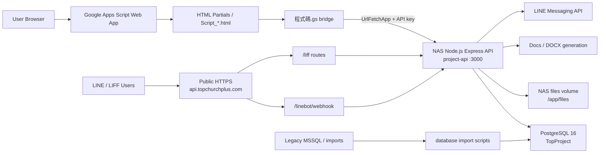
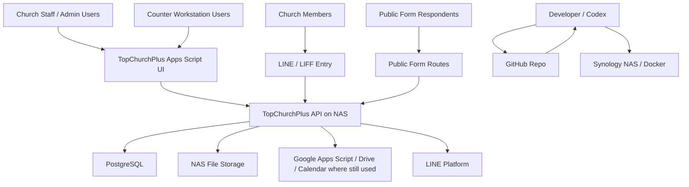

# Current Development Environment

最後更新：2026-06-12

本文件記錄目前 TopChurchPlus repository、設定檔、部署檔案與已驗證環境的現況。內容只根據目前實際檔案、既有文件與本次檢查結果整理；未能從檔案或檢查確認者標示為 `UNKNOWN`，尚未完成者標示為 `TODO`。

## 1. Executive Summary

TopChurchPlus 目前是以 Google Apps Script Web App 作為主要前端、以 Apps Script bridge 串接 NAS 上 Node.js API 與 PostgreSQL 的漸進式重構系統。前端仍由根目錄大量 `.html` partial 與 `Script_*.html` 組成，`Index.html` 負責組裝主要畫面，`程式碼.gs` 保留 `google.script.run` 相容層，並透過 Script Properties 中的 `API_BASE_URL` / `API_KEY` 呼叫 NAS API。API 位於 `api/`，使用 Express、Helmet、CORS、pg、dotenv 與 docx，Docker image 基於 `node:20-alpine`，服務容器名稱為 `project-api`，內網健康檢查為 `http://192.168.3.2:3000/health`。

資料庫目前是 NAS 上的 PostgreSQL container，已存在大量 SQL migration 與 schema 檔案，涵蓋系統帳號、權限、專案、財務、牧養、表單、資產、LINE/LIFF、BPM workflow 等資料表。migration 目前以 `database/*.sql` 檔案管理，多數採 `BEGIN` / `COMMIT` 與 `CREATE TABLE IF NOT EXISTS`，但尚未有完整自動 migration runner，正式異動前依文件要求先備份 PostgreSQL。

外部入口方面，正式檢查目標為 `https://api.topchurchplus.com/health` 與 `https://api.topchurchplus.com/linebot/webhook`，LINE/LIFF 後端基礎已存在。Reverse Proxy 的 DSM 畫面設定細節不在 repo 中，故細節列為 `UNKNOWN`。不應再測試 `59.120.6.172:3000`；外部 direct 3000 port 已關閉，逾時是預期結果。

## 2. Technology Stack

| Layer | Technology | Status |
| ----- | ---------- | ------ |
| Frontend | Google Apps Script Web App | Active |
| Frontend runtime | Apps Script V8 | Active |
| UI | HTML partials, JavaScript, Bootstrap-style classes | Active |
| Apps Script bridge | `程式碼.gs`, `google.script.run`, `UrlFetchApp` | Active |
| API runtime | Node.js 20 Alpine | Active |
| API framework | Express 4 | Active |
| API security middleware | Helmet, CORS, API key middleware | Active |
| Database client | `pg` | Active |
| Database | PostgreSQL 16 container `TopProject` | Active |
| Container runtime | Synology Container Manager / Docker Compose | Active |
| NAS | Synology NAS at `192.168.3.2` | Active |
| File storage | NAS mounted volume `./files:/app/files` | Active |
| Document generation | `docx` package in API | Active |
| LINE | LINE Messaging API, LIFF | Active foundation |
| Git hosting | GitHub `Skyking005/TopChurchPlus` | Active |
| Apps Script deploy CLI | `@google/clasp` | Active |
| Test scripts | PowerShell smoke tests under `tests/api` | Active |
| SQL lint tooling | SQLFluff configured in root `package.json` | Available |
| Browser testing tooling | Playwright dependency in root devDependencies | Available |
| Reverse proxy | Synology reverse proxy is implied by external HTTPS behavior | UNKNOWN details |
| Legacy data source | MSSQL import/sync scripts under `database/` | Transitional |

## 3. Repository Structure

```text
topchurchplus/
├─ api/
│  ├─ public/liff/
│  ├─ scripts/
│  ├─ src/
│  │  ├─ middleware/
│  │  ├─ modules/
│  │  └─ shared/
│  ├─ Dockerfile
│  ├─ docker-compose.yml
│  ├─ .dockerignore
│  └─ package.json
├─ database/
│  ├─ *.sql
│  ├─ *_from_sqlserver.ps1
│  ├─ templates/
│  └─ asset_import/
├─ docs/
│  ├─ architecture/
│  ├─ regression/
│  └─ *.md
├─ tests/api/
├─ tools/
├─ *.html
├─ Script_*.html
├─ 程式碼.gs
├─ appsscript.json
├─ .clasp.json
├─ .claspignore
├─ deploy-api.ps1
├─ deploy-api.cmd
└─ push-to-google.cmd
```

| Path | Purpose |
| ---- | ------- |
| `api/` | NAS Node.js API source, Docker runtime, LIFF static assets. |
| `api/src/index.js` | API composition root; registers all Express modules and middleware. |
| `api/src/modules/*/routes.js` | Feature API route modules. |
| `api/src/shared/` | Shared DB, permissions, audit, files, config, repository, notification, identity helpers. |
| `api/public/liff/` | LIFF static page, CSS and browser JavaScript. |
| `database/` | PostgreSQL schema/migration SQL, legacy import scripts, migration templates. |
| `docs/` | Architecture, workflow, recovery, API and module documentation. |
| `docs/architecture/` | Architecture-focused documentation. |
| `tests/api/` | API smoke tests and test helpers. |
| `tools/` | Local development, validation, AI context, deploy/check helper scripts. |
| Root `.html` files | Apps Script HTML screens/partials. |
| `Script_*.html` | Apps Script frontend logic partials. |
| `程式碼.gs` | Apps Script bridge and server-side Apps Script functions. |
| `appsscript.json` | Apps Script runtime, scopes and web app settings. |
| `.clasp.json` / `.claspignore` | clasp project binding and push ignore list. |
| `deploy-api.ps1` / `.cmd` | NAS API deployment helper. |
| `push-to-google.cmd` | Google Apps Script push/deploy helper. |

## 4. Database Environment

| Item | Current State |
| ---- | ------------- |
| Database type | PostgreSQL |
| Runtime container | `TopProject` |
| Image | `postgres:16` |
| Exposed port | `0.0.0.0:32770->5432/tcp` |
| API connection | `DATABASE_URL` from `api/.env` on NAS; value is secret and not recorded here |
| API DB helper | `api/src/db.js` with `Pool` and `tx(work)` |
| Migration location | `database/*.sql` |
| Backup expectation | NAS backups under `/volume1/docker/project-api/backups/` |

Existing schema groups observed in `database/*.sql`:

| Area | Tables / Files |
| ---- | -------------- |
| Core system | `accounts`, `departments`, `account_roles`, `role_feature_permissions`, `params`, `param_categories`, `param_items` |
| Audit and files | `audit_logs`, `files`, `file_links` |
| Identity bridge | `member_accounts`, `line_users`, `identity_providers`, `line_liff_sessions` |
| System config | `system_config` |
| Project and meetings | `projects`, `project_people`, `project_income`, `project_budget`, `project_permissions`, `meetings` |
| Finance | `purchases`, purchase items, advances, expense proofs, payment requests |
| Pastoral | `churches`, `pastoral_members`, contacts, addresses, faith, groups, relationships, care records |
| Forms | `forms`, questions, options, responses, answers, attachments |
| LINE / LIFF | `line_bot_channels`, modules, links, campaigns, rich menus, webhook events, binding requests |
| Education | `education_course_categories`, `education_courses`, `education_enrollments` |
| Attendance | `attendance_events`, `attendance_types`, `attendance_records` |
| Assets | `assets`, `asset_locations`, history, maintenance, acquisition links |
| Admin supply | supply items, stocks, movements |
| Counter / QR | `counter_pin_codes`, `counter_transactions`, `qrcode_events`, `qrcode_checkins` |
| Venue / Zoom | venue resources/reservations, zoom accounts/reservations |
| BPM | `bpm_definitions`, `bpm_instances`, `bpm_history` |
| Short links | `short_links`, `short_link_clicks` |
| Dev management | `development_issues`, `development_releases` |

Migration strategy:

- Current strategy is file-based SQL migration under `database/`.
- Many migrations are idempotent or partially idempotent using `CREATE TABLE IF NOT EXISTS`, `CREATE INDEX IF NOT EXISTS`, and `ON CONFLICT`.
- Several migrations include explicit `BEGIN` / `COMMIT`.
- Rollback exists for the LINE Bot Phase 0 foundation: `database/20260612_linebot_phase0_foundation_rollback.sql`.
- There is no confirmed automated migration runner integrated into deploy scripts.

TODO:

- Add a formal migration execution log or migration runner.
- Add a deployment checklist step that confirms which migrations have been applied.
- Document exact production PostgreSQL restore procedure with tested command examples.

## 5. Application Modules

| Module | Files | Current Status | Completed | TODO |
| ------ | ----- | -------------- | --------- | ---- |
| Authentication | `api/src/modules/auth/routes.js`, `Login.html`, `Script_Login.html` | Active | Login, verification, counter PIN login, login events | Continue reducing `Script_Login.html` size |
| System Management | `api/src/modules/system/routes.js`, `ParameterModal.html` | Active | Users, roles, feature permissions, params, logs, ID rules, config endpoints | Broaden UI for `system_config` if needed |
| Dev Management | `api/src/modules/dev-management/routes.js` | Active | Issues, document review, releases | Keep docs whitelist current |
| Project Management | `api/src/modules/project/routes.js` | Active | Projects, detail, permissions, meetings, documents | Project dashboard/document management improvements |
| Workflow/BPM | `api/src/modules/workflow/routes.js` | Foundation | Definitions, instances, history, dashboard | Full frontend workbench |
| Finance | `api/src/modules/finance/routes.js` | Active/Beta | Purchases, advances, expense proofs, payment requests, document output | Reports and budget analysis |
| Pastoral / Member | `api/src/modules/pastoral/routes.js` | Active foundation | Member CRUD, options, scope permissions | More merge/report/binding workflows |
| Forms | `api/src/modules/forms/routes.js` | Active | Form builder, public forms, responses, stats, attachments | More workflow/payment integration |
| Counter | `api/src/modules/counter/routes.js` | Active | PIN codes, transactions, paid state | Broader workstation flow |
| QT | `api/src/modules/qt/routes.js` | Active | Inventory, orders, reports, stock check | Legacy sync hardening |
| Education | `api/src/modules/education/routes.js` | Active foundation | Categories, courses, forecast, enrollments | Complete learner-facing integration |
| Attendance | `api/src/modules/attendance/routes.js` | Foundation | Options, small groups, meetings, recent member attendance | API/UI completeness |
| Asset | `api/src/modules/asset/routes.js` | Active | Asset list/detail, locations, source relation | Formal import verification |
| Admin Supply | `api/src/modules/admin-supply/routes.js` | Active | Items, stocks, movements | Operational polishing |
| Venue | `api/src/modules/venue/routes.js` | Foundation | Resources, reservations, availability | Complete UI/approval flow |
| Zoom | `api/src/modules/zoom/routes.js` | Active foundation | Accounts, availability, reservations | Operational validation |
| QRCode | `api/src/modules/qrcode/routes.js` | Active foundation | Events, active events, checkins | Scanner workflow polish |
| Sunday Message | `api/src/modules/sunday-message/routes.js` | Active foundation | Messages, options, shares | Module-specific reporting |
| Documents | `api/src/modules/documents/routes.js` | Active foundation | DOCX output endpoints | Template coverage |
| Short Links | `api/src/modules/shortlinks/routes.js` | Active | Link CRUD, ensure, resolve | Analytics/UI consolidation |
| LINE Bot / LIFF | `api/src/modules/linebot/*`, `api/src/modules/liff/*`, `api/public/liff/*` | Active foundation | Webhook, LINE API client, channel config, LIFF session, member binding request flow | Admin review UI for binding requests, LIFF ID completion |

## 6. Infrastructure Environment

| Component | Current Value | Source / Confidence |
| --------- | ------------- | ------------------- |
| NAS LAN IP | `192.168.3.2` | Docs, deploy scripts, current health check |
| NAS API path | `/volume1/docker/project-api` | Docs and deploy script |
| SMB path | `\\192.168.3.2\docker\project-api` | `deploy-api.ps1` |
| SSH deploy user | `cetu` | `deploy-api.ps1` |
| SSH key path | `%USERPROFILE%\.ssh\project_api_deploy` | `deploy-api.ps1`, current deployment usage |
| API container | `project-api` | Docker ps current check |
| API image | `project-api-project-api` | Docker ps current check |
| API port mapping | `0.0.0.0:3000->3000/tcp` | Docker ps current check |
| PostgreSQL container | `TopProject` | Docker ps current check |
| PostgreSQL image | `postgres:16` | Docker ps current check |
| PostgreSQL port mapping | `0.0.0.0:32770->5432/tcp` | Docker ps current check |
| Extra container | `linuxserver-librespeed-1` | Docker ps current check |
| Public API domain | `api.topchurchplus.com` | Docs and current external health check |
| Public API health | `https://api.topchurchplus.com/health` | Official external check target |
| Product domain | `topchurchplus.com` documented as Apps Script forwarding | Existing docs; not verified in this task |
| Reverse proxy rules | DSM reverse proxy implied; exact source/destination rules not in repo | UNKNOWN |
| SSL certificate details | `api.topchurchplus.com` should use the correct HTTPS certificate; if Synology/DSM certificate appears, check reverse proxy and certificate binding | UNKNOWN |

Deployment paths:

- API intended deploy script: `deploy-api.cmd` / `deploy-api.ps1`.
- Current reliable fallback documented in `AGENTS.md`: SSH/tar to `/volume1/docker/project-api`, then `docker compose up -d --build`.
- Apps Script deploy: `push-to-google.cmd`, which runs `clasp push -f` and `clasp deploy -i <DEPLOYMENT_ID>`.

## 7. LINE Bot Environment

| Item | Current State |
| ---- | ------------- |
| Webhook endpoint | `POST /linebot/webhook` |
| Webhook public URL | `https://api.topchurchplus.com/linebot/webhook` |
| Health endpoint | `GET /health`, public URL `https://api.topchurchplus.com/health` |
| LINE Bot basic ID | `@491eltya` observed in prior verification; repo does not store it as code |
| LINE API client | `api/src/modules/linebot/line-api-client.js` |
| LINE channel config | `line_bot_channels.metadata` plus newer `system_config` fallback/override |
| Secret storage | `system_config` for LINE token/secret/LIFF IDs; `.env` for API/DB secrets; values not committed |
| LIFF routes | `/liff`, `/liff/config`, `/liff/session`, `/liff/me`, `/liff/bind-member`, `/liff/portal-links` |
| LIFF static assets | `api/public/liff/index.html`, `liff.css`, `liff-app.js` |
| Member binding flow | LIFF verifies LINE ID token, creates session, binds by name + phone, writes `line_users`, `member_accounts`, `identity_providers`; unresolved cases create `line_binding_requests` |
| Webhook behavior | Records LINE events, syncs LINE profile when live API is available, replies to follow/command text |
| Current status | Foundation active; public health verified; full admin review UI for binding requests is TODO |

UNKNOWN:

- Current LIFF Portal ID value is not recorded in repo. Previous runtime check showed `LINE_LIFF_ID` empty at that time; this document does not expose runtime secrets.
- Rich Menu IDs and LINE Login channel exact values are not stored in repo.

## 8. Security Review

Environment variables and secret paths observed:

| Secret / Setting | Storage Method | Status |
| ---------------- | -------------- | ------ |
| `DATABASE_URL` | `api/.env` on NAS / local `.env` ignored by Git | Secret |
| `API_KEY` | `api/.env` and Apps Script Script Properties | Secret |
| `ALLOWED_ORIGINS` | `api/.env.example` shows expected key | Config |
| `API_BASE_URL` | Apps Script Script Properties via `setApiConfig()` | Config |
| LINE Channel Secret | `system_config` / legacy `line_bot_channels.metadata` | Secret |
| LINE Channel Access Token | `system_config` / legacy `line_bot_channels.metadata` | Secret |
| LINE LIFF ID | `system_config` / channel metadata | Secret/config |
| SSH private key | `%USERPROFILE%\.ssh\project_api_deploy` | Secret; not in repo |
| `.clasp.json` script binding | Local file; `.gitignore` excludes `.clasp.json` | Not committed |

Potential risks observed:

- `database/*.sql` migrations are file-based without a confirmed migration runner or applied-migration ledger.
- `deploy-api.ps1` expects SMB path availability; docs note SMB may be unavailable and SSH/tar is used as fallback.
- Apps Script bridge depends on Script Properties; missing `API_BASE_URL` / `API_KEY` throws runtime errors.
- Reverse proxy and SSL renewal details are not represented in repo.
- Existing docs may lag real environment state; for example older docs still mention external HTTPS as pending.
- Some secrets historically existed in `line_bot_channels.metadata`; Phase 0 added `system_config`, but transition state should be audited.
- `line_bot_channels.metadata` and `system_config` values must not be copied into AI context or documentation.
- Docker compose mounts `./files:/app/files`; backup/retention policy for user-uploaded files is not fully described in repo.

## 9. Known Technical Debt

| Area | Current Debt |
| ---- | ------------ |
| Apps Script frontend | Large `Script_Login.html` remains a central coordinator despite some extraction. |
| API service layering | Several `routes.js` files contain SQL and business logic directly; service/repository split is partial. |
| Migration process | SQL migrations are present, but no confirmed migration runner or applied-migration table. |
| Documentation freshness | Some docs contain now-outdated notes about LINE HTTPS status. |
| Identity migration | `line_users`, `member_accounts`, `identity_providers` coexist; transition rules must remain explicit. |
| LINE binding admin | `line_binding_requests` table exists and LIFF creates requests, but admin review UI/API is TODO. |
| LIFF config | LIFF ID and Login setup may still need final configuration. |
| External infrastructure docs | Reverse proxy, SSL certificate renewal, firewall/NAT details are outside repo or UNKNOWN. |
| Legacy MSSQL sync | Import/sync scripts exist; PostgreSQL is target, but legacy sources remain part of transition. |
| Automated deploy | API deploy exists, Apps Script deploy exists, but DB migration is not integrated into one deploy command. |

## 10. AI Development Context

Future AI agents must understand these boundaries before changing code:

- TopChurchPlus is not a greenfield app. It is a gradual migration from Google Apps Script / legacy data flows into NAS API and PostgreSQL.
- Apps Script is still the primary UI delivery surface. Do not assume React/Vue or a separate SPA exists.
- `程式碼.gs` is a bridge and compatibility layer; new business logic should prefer NAS API when possible.
- PostgreSQL is the strategic data store. New tables should use SQL migrations under `database/`, and DB changes require backup/verification.
- Administrative Domain and Pastoral Domain must remain separate.
- Administrative Domain includes `accounts`, `account_roles`, `role_feature_permissions`, feature access, staff login, system admin.
- Pastoral Domain includes `pastoral_members`, pastoral groups, member-facing identity, LINE/LIFF, `member_accounts`, `line_users`, `identity_providers`.
- Pastoral permissions must not depend on backend staff account roles.
- LINE user IDs are identity-provider identifiers, not member primary keys.
- `pastoral_members.id` is the current Pastoral Member identity anchor in this schema.
- LINE/LIFF external access must use LINE ID token verification and LIFF sessions, not Apps Script/backend staff sessions.
- Secrets must never be included in docs, AI context snapshots, commits, or final reports.

## Mermaid Architecture Diagram



## System Context Diagram



## Environment Matrix

| Environment | URL / Path | Runtime | Purpose | Status |
| ----------- | ---------- | ------- | ------- | ------ |
| Local repo | `D:\系統開發\topchurchplus` | Windows + PowerShell | Development workspace | Active |
| Local root tooling | root `package.json` | Node dev tools | clasp, ripgrep, ast-grep, Playwright, repomix, SQLFluff | Active |
| Apps Script project | `.clasp.json`, `appsscript.json` | Google Apps Script V8 | Main web app frontend | Active |
| Apps Script deployment | `push-to-google.cmd` | clasp | Push and deploy web app | Active |
| NAS API source | `/volume1/docker/project-api` | Synology filesystem | Runtime API directory | Active |
| NAS API container | `project-api` | Node 20 Alpine | Express API | Active |
| NAS API internal URL | `http://192.168.3.2:3000` | Docker port mapping | Internal API/health/smoke | Active |
| Public API URL | `https://api.topchurchplus.com` | Synology HTTPS reverse proxy implied | LINE webhook and external API access | Official target; proxy details UNKNOWN |
| PostgreSQL | `TopProject` | `postgres:16` | Main database | Active |
| DB backups | `/volume1/docker/project-api/backups/` | NAS filesystem | DB backup storage | Active path, policy TODO |
| API tests | `tests/api/run-smoke.ps1` | PowerShell | Smoke test suite | Active |
| Database migrations | `database/*.sql` | SQL files | Schema evolution | Active files, runner TODO |
| Legacy sync/import | `database/*_from_sqlserver.ps1` | PowerShell | MSSQL transition/import | Transitional |
