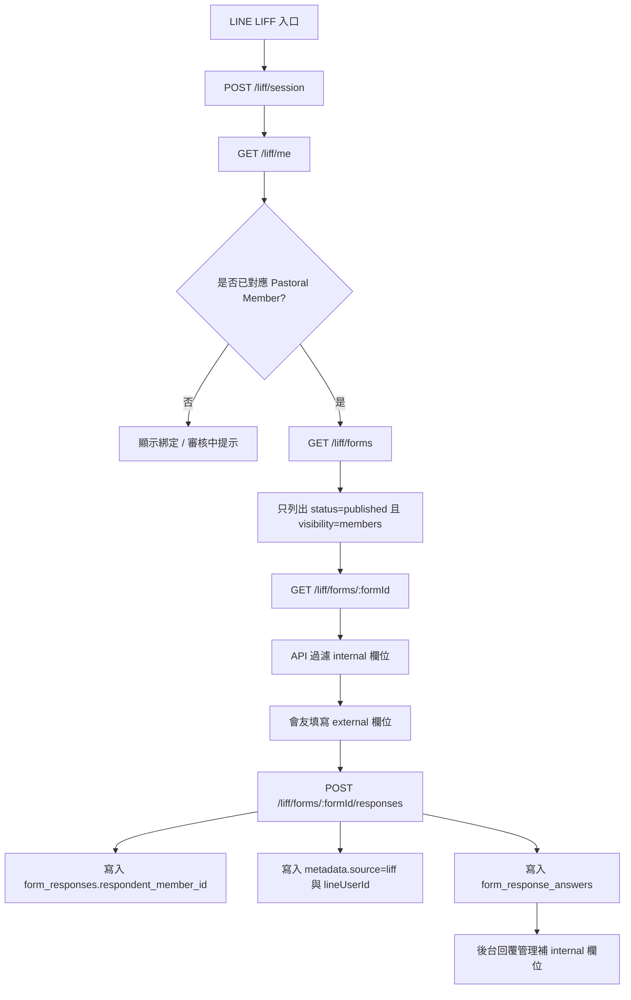
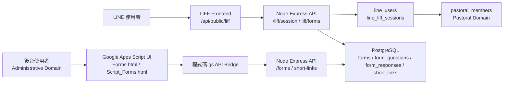

# Form System Extension Design

最後更新：2026-06-12

## 1. 現有表單系統盤點

TopChurchPlus 目前已有表單系統、公開表單流程與短網址管理基礎。此文件僅根據目前 repository、schema 與文件盤點現況，並評估「表單管理 / 短網址管理分頁」、「會友 LIFF 可填寫表單」、「欄位外部 / 內部填寫來源」的擴充方式。

### 現有前端

| 檔案 | 現況 |
| --- | --- |
| `Forms.html` | 表單系統主畫面，包含表單列表、表單編輯、填寫、回覆、統計等區塊；目前短網址管理區塊 `formsShortLinkAdminBlock` 內嵌在表單頁上方。 |
| `Script_Forms.html` | 表單列表、編輯、公開連結、填寫與回覆邏輯。`mountFormsShortLinkAdmin()` 會把既有 `shortLinkManagePane` 掛進表單頁。 |
| `程式碼.gs` | Apps Script bridge，提供 `getForms`、`saveForm`、`submitFormResponse`、`getPublicFormUrl`、`getShortLinks`、`saveShortLink`、`ensureShortLink`、`resolveShortLink` 等 wrapper。 |

### 現有 API

| 模組 | Endpoint | 現況 |
| --- | --- | --- |
| `api/src/modules/forms/routes.js` | `GET /forms` | 表單列表，支援 keyword/status。 |
| `api/src/modules/forms/routes.js` | `GET /forms/:formId` | 表單詳細與 questions/options。 |
| `api/src/modules/forms/routes.js` | `POST /forms`、`PUT /forms/:formId` | 表單建立 / 更新。儲存時會重建 questions。 |
| `api/src/modules/forms/routes.js` | `POST /forms/:formId/responses` | 後台登入使用者填寫。 |
| `api/src/modules/forms/routes.js` | `GET /public/forms/:formId` | 現有公開表單取得，限 `visibility = public`、`requireLogin = false`、`status = published`。 |
| `api/src/modules/forms/routes.js` | `POST /public/forms/:formId/responses` | 現有公開表單送出，未登入時要求 Email。 |
| `api/src/modules/liff/routes.js` | `/liff/session`、`/liff/me`、`/liff/bind-member`、`/liff/portal-links` | LIFF session 與會友綁定已存在。 |
| `api/src/modules/shortlinks/routes.js` | `/short-links`、`/short-links/ensure`、`/short-links/:shortCode/resolve` | 短網址管理與點擊紀錄已存在。 |

### 現有資料表

| 資料表 | 重要欄位 | 現況 |
| --- | --- | --- |
| `forms` | `visibility` | 已支援 `internal`、`public`、`members`。 |
| `forms` | `status` | 已支援 `draft`、`published`、`closed`、`archived`。 |
| `form_questions` | `metadata jsonb` | 可承載欄位填寫來源設定，不需立即新增欄位。 |
| `form_responses` | `respondent_staff_id` | 後台帳號填寫者。 |
| `form_responses` | `respondent_member_id` | 已可對應 `pastoral_members(id)`，符合 Identity Boundary v2。 |
| `form_responses` | `metadata jsonb` | 可暫存 LIFF/session/member mapping 補充資訊。 |
| `short_links` | `source_system`、`source_type`、`source_id` | 可用於表單短網址，不需重建短網址表。 |
| `short_link_clicks` | `link_id`、`clicked_at` | 已有點擊紀錄基礎。 |

### 重要限制

- 不得把 LINE User 視為正式會員主體。
- 不得用 `accounts.role` 判斷會友是否能填寫 LIFF 表單。
- Pastoral Member 才是正式會友主體。
- 現有公開表單 `/public/forms/:formId` 是 internet-public 概念，且未登入時要求 Email；不可直接等同 LIFF 會友入口。
- `replaceQuestions()` 目前會刪除並重建 `form_questions`，欄位 metadata 擴充必須保證前端儲存 payload 不遺失既有 metadata。

## 2. UI Tab 設計

表單系統頁面建議拆成兩個 top-level tabs：

1. 表單管理
2. 短網址管理

### 表單管理 Tab

負責：

- 表單新增
- 表單編輯
- 表單欄位設定
- 表單公開設定
- 表單狀態管理
- 表單回覆與統計

建議修改：

- 在 `Forms.html` 的 `formsView` 中新增 tab header。
- 將現有 `formsListView`、`formEditorView`、`formFillView`、`formResponsesView`、`formStatisticsView` 保留在「表單管理」tab 下。
- 新增 tab 切換函式，例如 `switchFormsTab('forms')`。

### 短網址管理 Tab

負責：

- 查看表單短網址
- 建立 / 更新短網址
- 查看短網址啟用狀態
- 查看對應表單
- 保留未來點擊統計擴充位置

建議修改：

- 將目前 `formsShortLinkAdminBlock` 移到「短網址管理」tab。
- 繼續重用既有 `shortLinkManagePane` 與 `mountFormsShortLinkAdmin()`。
- 權限仍依目前短網址 API：管理者以上層級，且需具備 forms feature 權限。
- 不新增 `short_links` 以外的新短網址資料表。

## 3. 表單公開設定設計

需求欄位：「是否於內部系統公開：是 / 否」。

此設定的語意是：表單是否可於 TopChurchPlus 會友入口 / LINE LIFF 流程中被會友查看並填寫。它不代表開放給所有網路訪客。

### 建議 MVP：沿用 `forms.visibility = members`

目前 `forms.visibility` 已有三種值：

| visibility | 現有 / 建議語意 |
| --- | --- |
| `internal` | 僅後台內部使用。 |
| `members` | 會友入口 / LIFF 可見；不等於 internet-public。 |
| `public` | 現有公開表單流程，允許未登入外部填寫，且目前要求 Email。 |

因此第二階段 MVP 可不新增 schema：

- UI 新增或調整顯示為「於 LINE 會友入口公開」。
- 選「是」時，將 `visibility` 設為 `members`。
- 選「否」時，若非 public 情境，將 `visibility` 設為 `internal`。
- 既有 `public` 保留給真正公開網址流程。

### 不建議做法

- 不建議把 LIFF 會友入口表單直接設成 `visibility = public`。
- 不建議把 `requireLogin` 解讀為 LINE 會友綁定狀態。
- 不建議以 `accounts.role` 判斷 LIFF 會友可見範圍。

## 4. 表單欄位填寫來源設計

每一個表單欄位新增「填寫來源」：

| 值 | 語意 |
| --- | --- |
| `external` | 由會友 / 使用者於 LIFF 或公開表單頁面填寫。預設值。 |
| `internal` | 不由外部填寫者填寫，由系統或內部人員補充、註記、審核或對應。 |

### 建議儲存方式

第二階段 MVP 可使用既有 `form_questions.metadata jsonb`：

```json
{
  "fillSource": "external",
  "internalField": {
    "kind": "none"
  }
}
```

內部填寫欄位：

```json
{
  "fillSource": "internal",
  "internalField": {
    "kind": "pastoral_member_ref",
    "label": "會友對應"
  }
}
```

建議 `internalField.kind`：

| kind | 用途 |
| --- | --- |
| `member_code_note` | 會友編號註記，例如舊系統匯入或人工辨識。 |
| `pastoral_member_ref` | 對應 `pastoral_members.id`。 |
| `staff_note` | 內部審核、補充說明。 |
| `none` | 無特殊內部欄位用途。 |

### 渲染規則

| 場景 | 規則 |
| --- | --- |
| 後台表單編輯 | 顯示所有欄位，並可設定填寫來源。 |
| 後台填寫 / 審核 | 可顯示外部與內部欄位。 |
| Public Form | 只顯示 `fillSource !== internal` 的欄位。 |
| LINE LIFF Form | 只顯示 `fillSource !== internal` 的欄位。 |
| 回覆管理 | 顯示外部答案與內部欄位，內部欄位可由內部人員補充。 |

### 注意

目前 `normalizeResponseAnswers()` 會根據 detail.questions 驗證必填欄位。若 LIFF / public 送出時仍把 internal required 欄位放入 questions，會造成外部使用者無法送出。因此第二階段若實作 LIFF 表單送出，API 必須在外部送出流程排除 internal questions，或在驗證時忽略 internal questions。

## 5. LINE LIFF 存取流程

建議新增 LIFF 專用表單流程，不直接重用現有 `/public/forms/:formId` 作為會友入口。

原因：

- `/public/forms/:formId` 目前代表 internet-public。
- public submit 目前未登入時要求 Email。
- LIFF 入口需要 LINE ID Token / LIFF session。
- LIFF 入口需要透過 `line_users` / `member_accounts` / `pastoral_members` 判斷會友綁定狀態。

### 建議 LIFF API

| Endpoint | 用途 | 權限 |
| --- | --- | --- |
| `GET /liff/forms` | 取得 LIFF 會友入口可見表單清單。 | 需要 LIFF session。 |
| `GET /liff/forms/:formId` | 取得 LIFF 表單詳細，僅回傳外部填寫欄位。 | 需要 LIFF session；表單需 `status = published` 且 `visibility = members`。 |
| `POST /liff/forms/:formId/responses` | LIFF 送出表單。 | 需要 LIFF session；若表單要求會友綁定，需有 `pastoral_members` mapping。 |

### 流程

1. 使用者從 LINE LIFF 開啟會友入口。
2. 前端呼叫 `/liff/session` 建立 session。
3. 前端呼叫 `/liff/me` 取得 LINE User 與 Pastoral Member mapping。
4. 前端呼叫 `/liff/forms` 取得 `visibility = members` 且 `status = published` 的表單。
5. 使用者選擇表單。
6. 前端呼叫 `/liff/forms/:formId`，API 只回傳外部填寫欄位。
7. 使用者送出。
8. API 寫入 `form_responses`：
   - `respondent_member_id = pastoral_members.id`，若已綁定。
   - `respondent_name = pastoral_members.name`，若已綁定。
   - `metadata.lineUserId = line_users.line_user_id`。
   - `metadata.source = "liff"`。
9. API 寫入 `form_response_answers`，但只接受外部填寫欄位。
10. 內部欄位由後台回覆管理流程補充。

## 6. Pastoral Member 對應方式

### Identity Boundary v2 原則

- LINE User 是外部入口身份，不是正式會員主體。
- Pastoral Member 是正式會友主體。
- LIFF / LINE 入口不可直接等同後台 `accounts`。
- 表單填寫紀錄若要對應會友，應寫入 `form_responses.respondent_member_id` 或 metadata 中的 pastoral mapping。
- 不得用 `accounts.role` 判斷會友可填寫範圍。

### 現有可用 mapping

目前 `api/src/modules/liff/routes.js` 的 `/liff/me` 已從 `line_users` 連到 `pastoral_members`：

- `line_users.line_user_id`
- `line_users.member_id`
- `pastoral_members.id`
- `pastoral_members.name`
- `pastoral_member_contacts.mobile_phone`

因此 LIFF 表單送出時應使用 LIFF session 的 `line_user_id` 查詢 `line_users.member_id`，再寫入 `form_responses.respondent_member_id`。

### 未綁定狀態

建議規則：

| 狀態 | 行為 |
| --- | --- |
| 已綁定 Pastoral Member | 可查看與填寫 `visibility = members` 表單。 |
| 未綁定 Pastoral Member | 不顯示 member-only 表單，或顯示綁定提示。 |
| 綁定審核中 | 不應自動視為正式 Pastoral Member；可顯示審核中狀態。 |

## 7. API 影響

### Forms API

建議第二階段最小改動：

- `GET /forms` 回傳目前 `visibility` 即可，不需新增欄位。
- `GET /forms/:formId` 回傳 `questions[].metadata.fillSource`。
- `POST /forms` / `PUT /forms/:formId` 接受並保存 `questions[].metadata.fillSource` 與 `questions[].metadata.internalField`。
- `GET /public/forms/:formId` 需排除 internal questions，避免外部填寫者看到內部欄位。
- `POST /public/forms/:formId/responses` 需忽略或拒絕 internal questions 的答案。

### LIFF API

建議新增在 `api/src/modules/liff/routes.js`：

- `GET /liff/forms`
- `GET /liff/forms/:formId`
- `POST /liff/forms/:formId/responses`

這些 endpoint 應使用既有 `requireLiffSession(req)`，並用 Pastoral Member mapping 判斷填寫者，而不是後台帳號。

### Apps Script Bridge

若 LIFF 前端直接打 NAS API，Apps Script 不一定需要新增 LIFF wrapper。若 Google Apps Script 也要呈現 LIFF 表單，才需要新增：

- `getLiffForms(payload)`
- `getLiffFormDetail(payload)`
- `submitLiffFormResponse(payload)`

### Short Links API

不需新增短網址 API。短網址管理 Tab 應沿用：

- `GET /short-links?sourceSystem=forms`
- `POST /short-links`
- `PUT /short-links/:linkId`
- `POST /short-links/ensure`

## 8. Database 影響

### 第二階段 MVP

可不新增 schema：

- 表單會友入口可見性：使用既有 `forms.visibility = members`。
- 欄位填寫來源：使用既有 `form_questions.metadata.fillSource`。
- 內部欄位用途：使用既有 `form_questions.metadata.internalField`。
- LIFF 回覆來源：使用既有 `form_responses.metadata`。
- Pastoral Member 對應：使用既有 `form_responses.respondent_member_id`。
- 短網址：使用既有 `short_links`、`short_link_clicks`。

### DBA Request

目前 MVP 不需要 migration。若未來需要報表查詢、審核流程與資料治理更清楚，建議另開 DBA Request。

#### 需要新增或調整的欄位

| 資料表 | 欄位 | 用途 | 必要性 |
| --- | --- | --- | --- |
| `forms` | `member_portal_enabled boolean NOT NULL DEFAULT false` | 將 LIFF/會友入口可見性從 `visibility` 中獨立出來。 | Optional |
| `form_responses` | `source_channel text NOT NULL DEFAULT 'internal'` | 區分 `internal`、`public`、`liff`。 | Optional |
| `form_responses` | `line_user_id text REFERENCES line_users(line_user_id) ON DELETE SET NULL` | 讓 LIFF 來源可直接查詢。 | Optional |

#### Migration 草案

```sql
BEGIN;

ALTER TABLE forms
  ADD COLUMN IF NOT EXISTS member_portal_enabled boolean NOT NULL DEFAULT false;

UPDATE forms
SET member_portal_enabled = true
WHERE visibility = 'members';

ALTER TABLE form_responses
  ADD COLUMN IF NOT EXISTS source_channel text NOT NULL DEFAULT 'internal',
  ADD COLUMN IF NOT EXISTS line_user_id text REFERENCES line_users(line_user_id) ON DELETE SET NULL;

CREATE INDEX IF NOT EXISTS idx_forms_member_portal_status
  ON forms (member_portal_enabled, status, updated_at DESC);

CREATE INDEX IF NOT EXISTS idx_form_responses_source_channel
  ON form_responses (source_channel, submitted_at DESC);

CREATE INDEX IF NOT EXISTS idx_form_responses_line_user
  ON form_responses (line_user_id, submitted_at DESC);

COMMIT;
```

#### Index 建議

- `forms(member_portal_enabled, status, updated_at DESC)`
- `form_responses(source_channel, submitted_at DESC)`
- `form_responses(line_user_id, submitted_at DESC)`

#### 向下相容風險

- 若同時保留 `visibility = members` 與 `member_portal_enabled`，兩者可能產生狀態不一致。
- 若新增 `line_user_id`，必須處理既有 LIFF 回覆 metadata 搬移。
- 若未來改用 `member_portal_enabled`，現有 UI/Apps Script/API 都需同步調整。

#### Rollback 建議

```sql
BEGIN;

DROP INDEX IF EXISTS idx_form_responses_line_user;
DROP INDEX IF EXISTS idx_form_responses_source_channel;
DROP INDEX IF EXISTS idx_forms_member_portal_status;

ALTER TABLE form_responses
  DROP COLUMN IF EXISTS line_user_id,
  DROP COLUMN IF EXISTS source_channel;

ALTER TABLE forms
  DROP COLUMN IF EXISTS member_portal_enabled;

COMMIT;
```

## 9. 風險與待確認事項

### 風險

| 風險 | 說明 | 建議 |
| --- | --- | --- |
| `visibility` 語意混淆 | `public` 與 `members` 必須清楚區分，否則會把會友入口誤開成 internet-public。 | UI 文案需明確標示「會友入口 / LIFF」與「公開網址」。 |
| internal required 欄位造成外部送出失敗 | 現有答案驗證會檢查必填欄位。 | LIFF/public detail 與 submit 都要排除 internal questions。 |
| questions 被整批重建 | `replaceQuestions()` 會刪除並重建 questions，metadata 若未從前端帶回會遺失。 | 前端 save payload 必須保留 metadata；第二階段需測既有欄位。 |
| 既有回覆關聯 | `form_response_answers.question_id` 指向 questions，重建 questions 可能影響既有回覆查詢。 | 第二階段避免改動 question persistence；若要修需另開資料模型任務。 |
| LIFF 未綁定會友 | LINE User 不是 Pastoral Member。 | member-only forms 預設要求綁定，未綁定顯示綁定提示。 |
| 短網址權限 | 短網址管理只允許管理者以上。 | UI Tab 需沿用 `isShortLinkAdminUser()` 與 API 權限。 |
| Apps Script 編碼問題 | 現有多個 HTML/GS 讀取時呈現亂碼。 | 第二階段修改文件前需確認 UTF-8 編碼與 diff，避免擴大亂碼。 |

### 待確認事項

1. 「是否於內部系統公開」是否接受 MVP 以 `visibility = members` 表示。
2. LIFF member-only 表單是否必須要求已綁定 Pastoral Member，或允許未綁定先填寫再審核。
3. 內部填寫欄位第一版是否只需 metadata 設計，還是要做後台回覆審核 UI。
4. 表單短網址是否只管理 public form URL，或也要支援 LIFF deep link。
5. LIFF 表單是否需要支援有費用表單與 counter transaction。

## 10. Mermaid Flow Diagram



## 11. System Context Diagram



## 12. 第二階段實作評估

### 預計修改檔案

若使用無 schema MVP，預計修改：

- `Forms.html`
- `Script_Forms.html`
- `程式碼.gs`，僅在 Apps Script bridge 需要新增 wrapper 時
- `api/src/modules/forms/routes.js`
- `api/src/modules/liff/routes.js`
- `api/public/liff/index.html`
- `api/public/liff/liff-app.js`
- `docs/API_CATALOG.md`
- `docs/CURRENT_ARCHITECTURE.md` 或 `docs/HANDOFF.md`，視實作範圍更新

### 是否需要 migration

第二階段 MVP 不需要 migration。

前提：

- 使用 `forms.visibility = members` 表示會友入口可見。
- 使用 `form_questions.metadata` 儲存欄位填寫來源。
- 使用 `form_responses.respondent_member_id` 與 `metadata` 儲存 LIFF 回覆來源。

### 是否影響既有表單

預期不影響既有表單資料，但有兩個需測項：

- 既有表單編輯儲存後，原本 questions/options/metadata 不應遺失。
- public form detail/submit 過濾 internal questions 後，不應破壞原本 public form。

### 是否影響 LINE LIFF

會新增 LIFF 表單入口能力。若只新增 `/liff/forms` API 與 LIFF 前端頁面區塊，不改 LIFF channel 設定、不改 LINE Developer Console、不改 production config。

### 驗證方式

1. `git diff` 確認只包含預期檔案。
2. API smoke test：
   - `GET /forms`
   - `GET /forms/:formId`
   - `GET /public/forms/:formId`
   - `GET /short-links?sourceSystem=forms`
3. LIFF API smoke test：
   - `POST /liff/session` 使用現有流程。
   - `GET /liff/me` 確認 member mapping。
   - `GET /liff/forms` 只列出 member-visible forms。
4. 表單行為測試：
   - 建立 `visibility = members` 表單。
   - 建立 external 與 internal 欄位。
   - LIFF/public 填寫頁不顯示 internal 欄位。
   - 送出時不要求 internal required 欄位。
   - 回覆寫入 `respondent_member_id`。
5. 短網址測試：
   - 短網址管理 Tab 可載入既有 `shortLinkManagePane`。
   - `ensureShortLink` 不建立重複表單短網址。

## 13. 結論

此擴充可分兩階段進行：

1. 第一階段，本文件完成設計與影響分析，不修改業務程式與 schema。
2. 第二階段，可先做無 schema MVP：UI tabs、`visibility = members` 會友入口公開、`form_questions.metadata.fillSource` 欄位來源設定、LIFF forms API 與 Pastoral Member mapping。

在 DBA 未確認前，不建議新增資料表或直接改變正式資料模型。
