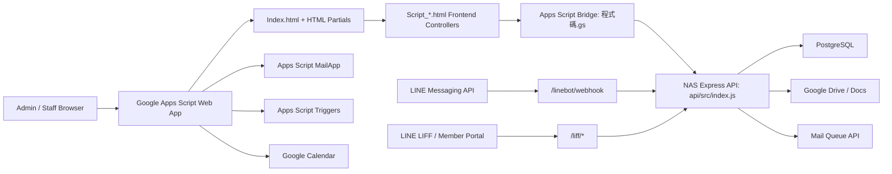

# TopChurchPlus System Map

Status: Generated from repository inspection
Last updated: 2026-06-14
Scope: Documentation only. Verify actual code, database schema, API catalog, and deployment state before implementation.

## Source Files Inspected

* `Index.html`
* `Script_FeatureConfig.html`
* `程式碼.gs`
* `appsscript.json`
* `package.json`
* `api/package.json`
* `api/src/index.js`
* `api/src/modules/*/routes.js`
* `api/src/shared/*.js`
* `database/*.sql`
* `database/migrations/*.sql`
* `docs/INDEX.md`
* `docs/architecture/README.md`

## Executive Map

TopChurchPlus is a Google Apps Script front end backed by a NAS-hosted Express API and PostgreSQL database. The Apps Script UI is assembled from HTML partials and script partials in `Index.html`. Most front-end operations call Apps Script bridge functions in `程式碼.gs`, which call the NAS API through `apiRequest()`. The Express API in `api/src/index.js` registers module routers and uses request context, API key middleware, and a centralized error handler. PostgreSQL schema is defined by base schema files and dated migrations under `database/`.

Public-facing entry points are intentionally narrow. `/health` and `/linebot/webhook` are public API paths, and `/liff` routes are public-prefixed by middleware. Other API usage should pass through Apps Script or authenticated API-key access. External production smoke tests should use `https://api.topchurchplus.com/health` and `https://api.topchurchplus.com/linebot/webhook`; direct external `59.120.6.172:3000` testing is not a valid health signal.

## Architecture Diagram

## Runtime Layers

| Layer | Source | Responsibility | Status |
| --- | --- | --- | --- |
| Apps Script shell | `Index.html`, `程式碼.gs` | Web app entry, partial include, bridge calls, public form routing | Active |
| UI partials | `*.html`, `Script_*.html` | Module pages and browser-side controllers | Active |
| API server | `api/src/index.js`, `api/src/app.js` | Express app, middleware, route registration | Active |
| Module APIs | `api/src/modules/*` | Domain-specific API endpoints | Active |
| Shared services | `api/src/shared/*` | Audit, config, users, permissions, files, params, id rules | Active |
| Database | `database/*.sql`, `database/migrations/*.sql` | PostgreSQL schema and migrations | Active |
| Public LINE/LIFF | `api/src/modules/linebot`, `api/src/modules/liff` | LINE webhook, LIFF session, member portal | Active |
| Mail infrastructure | `api/src/modules/mail`, Apps Script Email UI | Mail queue status and management | Active |
| Document generation | `api/src/modules/documents` | DOCX generation for project and finance documents | Active |

## API Entrypoint

`api/src/index.js` registers:

* Request context middleware.
* API key middleware with public paths:
  * `/health`
  * `/linebot/webhook`
* Public prefixes:
  * `/liff`
* Module routes:
  * Core, Auth, Counter, Dev Management, Documents, System, Attendance, Pastoral, Admin Supply, Asset, Finance, Forms, Education, Line Bot, LIFF, Mail, Project, QRCode, QT, Shortlinks, Sunday Message, Venue, Workflow, Worklog, Zoom.

## Apps Script Entrypoint

`Index.html` includes Bootstrap, Tabler Icons, Summernote, html5-qrcode, app-wide state partials, and module partials. The front-end module registry is defined in `Script_FeatureConfig.html`.

## Identity Boundary

Identity Boundary v2 remains a core constraint:

* Administrative Domain uses accounts, roles, and system permissions.
* Pastoral Domain uses pastoral members, groups, churches, and pastoral-scoped permissions.
* LINE User is not the formal member identity.
* Pastoral Member is the formal member subject.
* LIFF / LINE access must not be treated as a back-office account role.

## External Integration Map

| Integration | Evidence | Purpose |
| --- | --- | --- |
| LINE Messaging API | `api/src/modules/linebot/*` | Webhook, rich menus, binding requests, LINE user records |
| LINE LIFF | `api/src/modules/liff/*` | Member portal and LIFF sessions |
| Google Apps Script | `appsscript.json`, `程式碼.gs` | Main UI hosting and Google service bridge |
| Google Drive / Docs | `appsscript.json`, document routes | File storage and document output |
| Google Calendar | Apps Script scopes and venue/zoom modules | Venue and Zoom availability support |
| MailApp / ScriptApp | `appsscript.json`, Email Service UI | Mail queue, quota, trigger management |
| Synology / Docker | Deployment docs and scripts | NAS-hosted API and containers |
| PostgreSQL | `api/package.json`, `database/*.sql` | Primary database |

