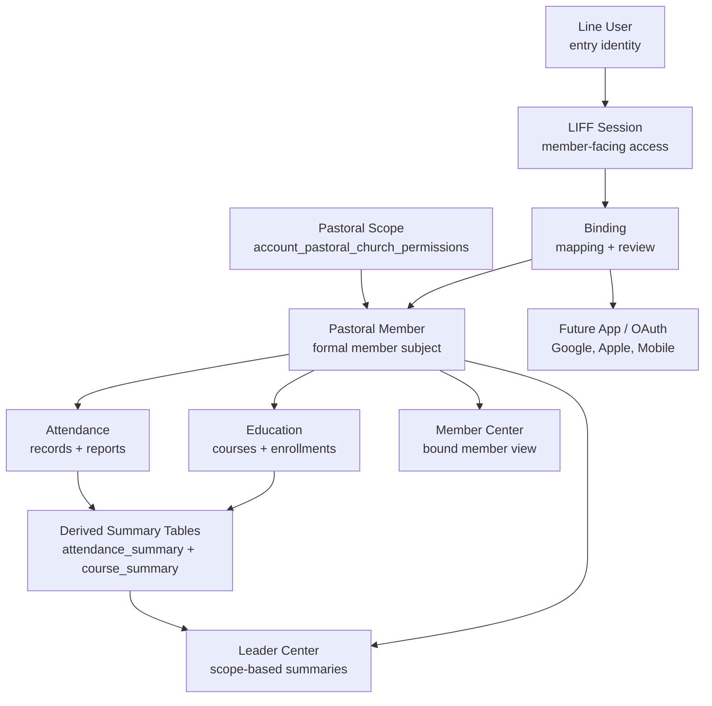

# Pastoral Platform Roadmap V1

Status: Planning Only
Last updated: 2026-06-14

## Goal

Complete the core Pastoral Platform around:

```text
Pastoral Member -> Attendance -> Education -> Line User -> LIFF Member Center
```

The roadmap prioritizes identity safety and operational completeness over flashy new features.

## Dependency Graph



## Quick Wins: 1-2 Weeks

1. Create a read-only identity mapping consistency report.
2. Define operational binding statuses and conflict reasons.
3. Add a Pastoral Member identity panel design:
   - member code
   - Line binding
   - member account
   - identity provider
4. Document attendance source-of-truth:
   - raw records
   - import/source channels
   - summary table ownership.
5. Document education enrollment/completion source-of-truth.
6. Add smoke checklist cases for:
   - unbound LIFF user
   - bound LIFF user
   - leader center allowed/denied
   - pastoral scope.

## Mid-Term: 1-3 Months

1. Binding review completion:
   - duplicate candidate review
   - approve/reject audit
   - conflict dashboard
2. Attendance integration:
   - standard recording/write boundary
   - raw-to-summary reconciliation
   - member attendance timeline
3. Education integration:
   - enrollment management
   - completion marking
   - member education journey
4. LIFF Member Center:
   - member profile summary
   - attendance summary
   - education summary
   - pastoral-safe menu/links.
5. Regression tests for Identity Boundary v2.

## Long-Term: 3-12 Months

1. Member merge and duplicate resolution.
2. Full pastoral care workflow:
   - attendance absence triggers
   - care assignment
   - follow-up tracking.
3. Education path and graduation engine.
4. Mobile App authentication:
   - Google Login
   - Apple Login
   - OAuth provider abstraction
   - device/session management.
5. Member-facing profile correction and consent management.
6. Cross-domain pastoral analytics.

## What Can Be Done Before 8月

Likely feasible:

- Mapping consistency audit/report.
- Binding review workflow tightening.
- Pastoral Member identity panel.
- Attendance source-of-truth documentation and read-only reconciliation.
- Education read-only journey and enrollment visibility.
- LIFF Member Center minimum viable data.

Should be deferred unless explicitly prioritized:

- Full member merge workflow.
- Full mobile app auth.
- Full education path/graduation engine.
- Automated pastoral care triggers.
- Large schema redesign.

## Major Risks

| Risk | Severity | Mitigation |
| --- | --- | --- |
| Mapping drift between LINE and Pastoral tables | High | Add consistency report and controlled binding updates. |
| Pastoral scope regression | High | Add smoke tests for scoped users. |
| Summary table staleness | Medium | Define refresh ownership and reconciliation. |
| Education workflow incompleteness | Medium | Prioritize enrollment/completion before path engine. |
| Future app identity coupling | Medium | Keep `identity_providers` as mapping layer, not member entity. |

## Release Gate

Pastoral Platform should not be considered complete until:

- Pastoral Member remains the formal subject in all pastoral-facing data.
- LINE User and Account are never treated as member.
- Attendance facts are traceable to Pastoral Member.
- Education facts are traceable to Pastoral Member.
- LIFF Member Center rejects unbound sessions.
- Binding conflicts are reviewable by admin.
- Future app identity can plug into `identity_providers` without changing the member subject.
